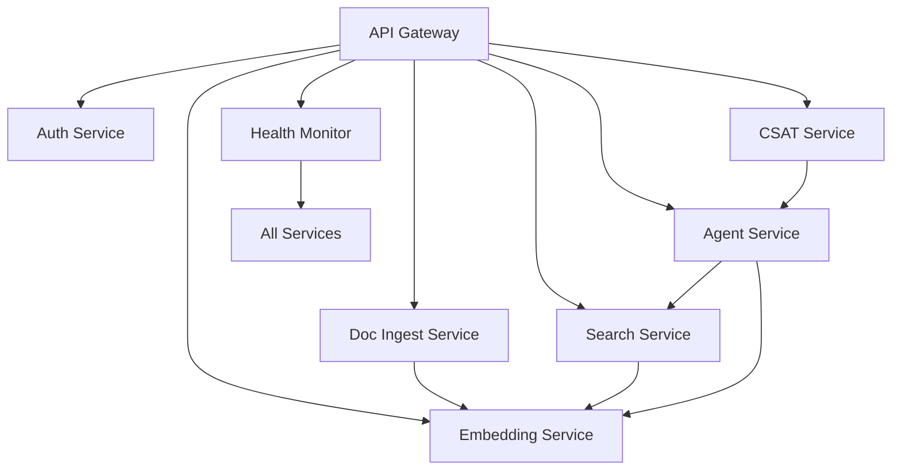

# AI-KMS System Integration Guide

## Architecture Overview

AI-KMS follows a microservices architecture with the following integration patterns:

### Service Communication

**HTTP REST APIs:**
- Synchronous service-to-service communication
- JSON request/response format
- Standardized error handling
- OpenAPI specifications

**Event-Driven Architecture:**
- Document processing events
- Search indexing events  
- User activity events
- System health events

### Integration Layers

#### 1. API Gateway Layer
- **Request Routing**: Routes requests to appropriate services
- **Authentication**: Enforces auth across all services
- **Rate Limiting**: Protects services from overload
- **Request Validation**: Validates input before forwarding

#### 2. Service Layer
- **Auth Service**: Authentication and authorization
- **Document Ingestion**: File processing and extraction
- **Search Service**: Hybrid search capabilities
- **Embedding Service**: Vector operations
- **Agent Service**: AI chat orchestration
- **CSAT Service**: Sentiment analysis
- **Health Monitor**: System monitoring

#### 3. Data Layer
- **PostgreSQL**: Relational data storage
- **Vector Store**: Embeddings and semantic search
- **File Storage**: Document and asset storage
- **Cache Layer**: Performance optimization

## Service Dependencies



## Integration Patterns

### 1. Service Discovery
- Automated service detection
- Health status monitoring
- Dynamic routing configuration

### 2. Error Handling
- Graceful degradation
- Circuit breaker pattern
- Retry mechanisms
- Fallback strategies

### 3. Authentication Flow
```
Client -> API Gateway -> Auth Service -> Target Service
```

### 4. Data Processing Pipeline
```
Upload -> Document Ingestion -> Text Extraction -> Embedding Generation -> Vector Storage -> Search Index
```

## Configuration Management

### Environment-Based Configuration
- Development: Local services
- Staging: Simulated production
- Production: Distributed services

### Service Configuration
Each service maintains its own configuration while sharing common patterns:

```typescript
interface ServiceConfig {
  port: number;
  database: DatabaseConfig;
  auth: AuthConfig;
  dependencies: ServiceDependency[];
}
```

## Monitoring and Observability

### Health Checks
- Service-level health endpoints
- System-wide health aggregation
- Dependency health validation

### Logging Strategy
- Structured JSON logging
- Request correlation IDs
- Service-specific log levels
- Centralized log aggregation

### Metrics Collection
- Response time tracking
- Error rate monitoring
- Resource utilization
- Business metrics

## Testing Strategy

### Unit Tests
- Individual service logic
- Use case implementations
- Domain model validation

### Integration Tests  
- Service-to-service communication
- Database interactions
- External API integration

### End-to-End Tests
- Full user workflows
- Cross-service scenarios
- Performance validation

## Deployment Pipeline

### Build Process
1. Code compilation (TypeScript)
2. Dependency installation
3. Asset bundling (React)
4. Configuration validation
5. Health check verification

### Deployment Stages
1. **Build**: Compile and package services
2. **Test**: Run automated test suites  
3. **Deploy**: Deploy to production environment
4. **Verify**: Validate deployment health
5. **Monitor**: Continuous health monitoring

## Security Integration

### Authentication
- JWT token validation
- Service-to-service auth
- Role-based access control

### Data Protection
- Input sanitization
- SQL injection prevention
- XSS protection
- CSRF protection

### Network Security
- HTTPS enforcement
- CORS configuration
- Rate limiting
- Request validation

## Performance Optimization

### Caching Strategy
- Application-level caching
- Database query caching
- CDN for static assets
- Vector embedding caching

### Database Optimization
- Connection pooling
- Query optimization
- Index management
- Partitioning strategy

### Service Optimization
- Async processing
- Connection reuse
- Request batching
- Response compression
